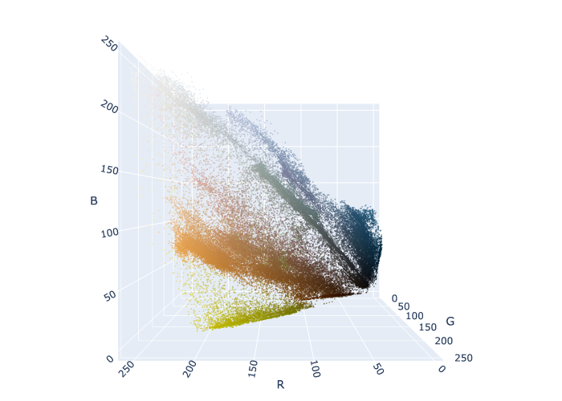
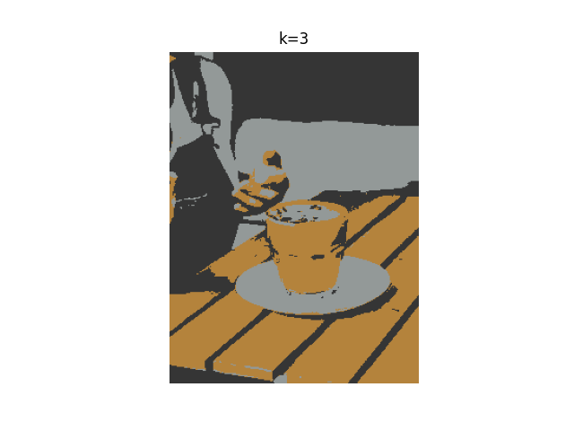
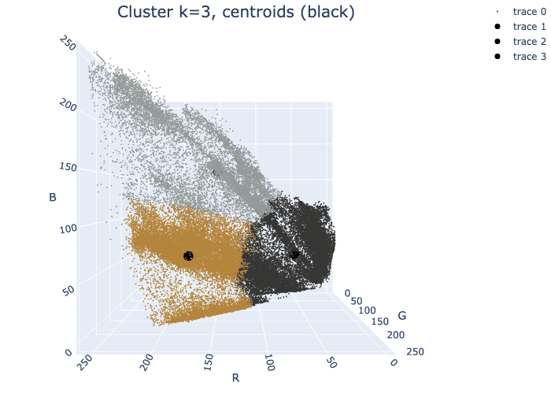
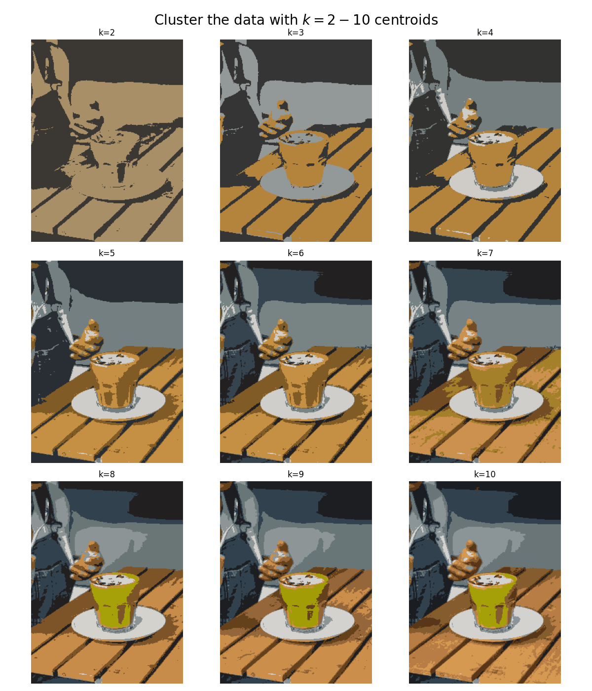

K-means for color compression
=========

## Objective

We will use K-means to cluster the pixels of a photograph based on their encoded color values. We will explore how different values of k affect the clustering of the pixels, and thus the appearance of the photograph.

## Read in data

The data is a photograph, which we'll convert into a numerical array.

```python
# URL image
url = "https://images.unsplash.com/photo-1705862667646-54de4f9fe1fe?w=800&auto=format&fit=crop&q=60&ixlib=rb-4.0.3&ixid=M3wxMjA3fDB8MHx0b3BpYy1mZWVkfDIwNHx4alBSNGhsa0JHQXx8ZW58MHx8fHx8"

# Fetch the image
response = requests.get(url)
img = Image.open(BytesIO(response.content))

# Resize the image
img_resized = img.resize((240, 320)) 

# Save/display the image
img_resized.show()  
img_resized.save("images_input/resized_image_from_url.jpg")
```


*Fig: Input image of a matcha latte.*


The shape of the image is 320 x 240 x 3. This is pixel information. Each dot on your screen is a pixel. This photograph has 320 vertical pixels and 240 horizontal pixels. 

The dimension "3" refers to the values that encode the color of each pixel. Each pixel has 3 parameters: red (R), green (G), and blue (B), also known as its RGB values. For each color—R, G, and B—the encoded value can range from 0-255. This means that there are $256^3$, or $16777216$ different combinations of RGB, each resulting in a unique color on your screen. 

To prepare this data for modeling, we'll reshape it into an array, where each row represents a single pixel's RGB color values.

```python
# Reshape the image so that each row represents a single pixel defined by three values: R, G, B
img_flat = img.reshape(img.shape[0]*img.shape[1], 3)
img_flat[:10, :]

 >>>
 array([[52, 28, 16],
       [50, 26, 14],
       [47, 24, 16],
       [47, 24, 18],
       [48, 24, 20],
       [48, 24, 22],
       [44, 22, 24],
       [43, 21, 23],
       [43, 18, 21],
       [42, 18, 18]], dtype=uint8)
```

### Plot the data in 3D space

Now we have an array that is 76,800 x 3. Each row is a single pixel's color values. Because we have only 3 columns, we can visualize this data in 3-dimensional space. Let's create a pandas dataframe to help us understand and visualize our data.

```python
# Create a pandas df with r, g, and b as columns
img_flat_df = pd.DataFrame(img_flat, columns = ['r', 'g', 'b'])

img_flat_df.head(10)

>>>
```
| r  | g  | b  |
|----|----|----|
| 0  | 52 | 28 | 16 |
| 1  | 50 | 26 | 14 |
| 2  | 47 | 24 | 16 |
| 3  | 47 | 24 | 18 |
| 4  | 48 | 24 | 20 |
| 5  | 48 | 24 | 22 |
| 6  | 44 | 22 | 24 |
| 7  | 43 | 21 | 23 |
| 8  | 43 | 18 | 21 |
| 9  | 42 | 18 | 18 |

### # Create 3D plot where each pixel in the `img` is displayed in its actual color

```python
trace = go.Scatter3d(x = img_flat_df.r,
                     y = img_flat_df.g,
                     z = img_flat_df.b,
                     mode='markers',
                     marker=dict(size=1,
                                 color=['rgb({},{},{})'.format(r,g,b) for r,g,b 
                                        in zip(img_flat_df.r.values, 
                                               img_flat_df.g.values, 
                                               img_flat_df.b.values)],
                                 opacity=0.5))

data = [trace]

camera = dict(
    eye=dict(x=0, y=2, z=0), # adjust
    center=dict(x=0, y=0, z=0),
    up=dict(x=0, y=0, z=1)
)

layout = go.Layout(
    margin=dict(l=0, r=0, b=0, t=0),
    scene=dict(camera=camera)
)

fig = go.Figure(data=data, layout=layout)
fig.update_layout(scene = dict(
                    xaxis_title='R',
                    yaxis_title='G',
                    zaxis_title='B'),
                  )

fig.write_image('output/scatter3d_pixel_color.png')
fig.show()
```



*Fig: Pixels of the image in 3d (RGB) space, one can see the various clusters of colors. Blue, orange, and green-yelowish are predominant.*

### Cluster the data with k=3

```python
# Instantiate k-means model for 3 clusters
kmeans3 = KMeans(n_clusters=3, random_state=42).fit(img_flat)

# Check the unique values of what's returned by the .labels_ attribute 
np.unique(kmeans3.labels_)
```

The `.cluster_centers_` attribute returns an array where each element represents the coordinates of a centroid (i.e., their RGB values). We'll use these coordinates as we did previously to generate the colors that are represented by our centroids.

```python
# Assign centroid coordinates to `centers` variable
centers = kmeans3.cluster_centers_

centers1 = centers[0].tolist()
centers2 = centers[1].tolist()
centers3 = centers[2].tolist()

centers

>>>
array([[180.74540763, 131.75819309,  60.1234644 ],
       [147.18807362, 153.50891079, 152.82484339],
       [ 53.71005291,  53.6354828 ,  53.20257937]])
```

Let's now replace each pixel in the original image with the RGB value of the centroid to which it was assigned.

```python
# Helper function to display our photograph when clustered into k clusters
def cluster_image(k, img=img):
    '''
    Fits a K-means model to a photograph.
    Replaces photo's pixels with RGB values of model's centroids.
    Displays the updated image.

    Args:
      k:    (int)          - Your selected K-value
      img:  (numpy array)  - Your original image converted to a numpy array

    Returns:
      The output of plt.imshow(new_img), where new_img is a new numpy array \
      where each row of the original array has been replaced with the \ 
      coordinates of its nearest centroid.
    '''

    img_flat = img.reshape(img.shape[0]*img.shape[1], 3)
    kmeans = KMeans(n_clusters = k, random_state = 42).fit(img_flat)
    new_img = img_flat.copy()
  
    for i in np.unique(kmeans.labels_):
        new_img[kmeans.labels_ == i, :] = kmeans.cluster_centers_[i]
  
    new_img = new_img.reshape(img.shape)

    return plt.imshow(new_img), plt.axis('off'), plt.title('k=3'), plt.savefig('output/image_output_k3.png');
```

Generate image when k=3

```python
cluster_image(3);
```



*Fig: Image where we assign each pixel the color of the centriod to which they belong to (here k=3 and therefore there's only three colors)*

We now have a photo with just three colors. Each pixel's RGB values correspond to the values of its nearest centroid. 

We can return once more to our 3-D colorspace. This time, we'll re-color each dot in the colorspace to correspond with the color of its centroid. This will allow us to see how the K-means algorithm clustered our data spatially.



*Fig: The centroids are shown in black round markers. One can see the clustering of three main groups: orange, gray, black.*

### Cluster data with k=2, ..., k=10

As we increase the number of clusters it becomes increasingly difficult to see the difference between the images each time a color is added. This is a visual example of something that happens with all clustering models, even if the data is not an image that you can see. As we group the data into more and more clusters, additional clusters beyond a certain point contribute less and less to the understanding of our data.



*Fig: The different panels show the data clustering from k=2 up to k=10. As one increases the number of clusters, different colors emerge in the grouping. Qualitatively, there's no big difference between k=8 and k=10, suggesting that our data is reasonably well explain by 8 colors or clusters (k=8).*


